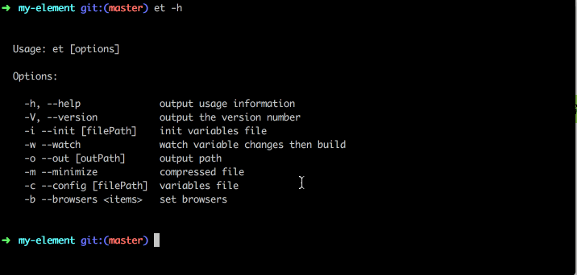

# notice
 - node<12 npm install element-theme
 - node=12.x npm install element-themex
 - node>=14 npm install element-theme-replace
 - element-theme-chalk/src/common/var.scss 中 $--breakpoints-spec 语法错误, 导致生成的变量文件element-variables.scss 也有此问题，请自行修改为
    ```
    $--breakpoints-spec: (
      'xs-only': (max-width: $--sm - 1),
      'sm-and-up': (min-width: $--sm),
      'sm-only': (min-width: #{$--sm}) and (max-width: #{$--md - 1}),
      'sm-and-down': (max-width: $--md - 1),
      'md-and-up': (min-width: $--md),
      'md-only': (min-width: #{$--md}) and (max-width: #{$--lg - 1}),
      'md-and-down': (max-width: $--lg - 1),
      'lg-and-up': (min-width: $--lg),
      'lg-only': (min-width: #{$--lg}) and (max-width: #{$--xl - 1}),
      'lg-and-down': (max-width: $--xl - 1),
      'xl-only': (min-width: $--xl),
    );
    ```

# element-theme
[](https://travis-ci.org/ElementUI/element-theme)
[](https://www.npmjs.com/package/element-theme)

> Theme generator cli tool for Element.



> The current version is compatible with element-ui@2.x.

## Installation
install local or global
```shell
npm i element-theme-replace -D
```

install `theme-chalk`
```shell
npm i element-theme-chalk -D
# or from github
npm i https://github.com/ElementUI/theme-chalk -D
```

## CLI
```shell
# init variables file
et --init [file path]

# watch then build
et --watch [--config variable file path] [--out theme path]

# build
et [--config variable file path] [--out theme path] [--minimize]
```

## Node API
```javascript
import et from 'element-theme-replace'

// watch mode
et.watch({
  config: 'variables/path',
  out: 'output/path'
})

// build
et.run({
  config: 'variables/path',
  out: 'output/path',
  minimize: true
})
```

## Options
### config
Variable file path, default `./element-variables.scss`.

### out
Theme output path, default `./theme`.

### minimize
Compressed file.

### browsers
set browsers, (array): list of queries for target browsers. Try to not use it. The best practice is to use .browserslistrc config or browserslist key in package.json to share target browsers with Babel, ESLint and Stylelint. See [Browserslist docs](https://github.com/browserslist/browserslist#queries) for available queries and default value.

### watch
watch variable file changes then build.

### components
A lists of components that you want to generate themes for.  All by default.

## Config
You can configure some options in `element-theme` by putting it in package.json:
```json
{
  "element-theme": {
    "debug": false, // sass版本大于1.43.0时，关闭警告信息
    // "browsers": ["ie > 9", "last 2 versions"], 
    "out": "./theme",
    "config": "./element-variables.scss",
    "theme": "element-theme-chalk",
    "minimize": false,
    // "components": ["button", "input"]
  }
}
```

## License
MIT
